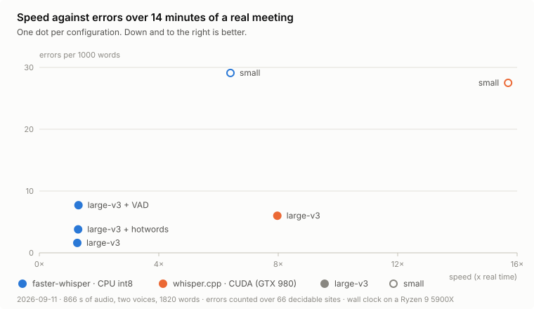

# speechtotext

A **100% local** speech-to-text library and CLI: transcription with
[`faster-whisper`](https://github.com/SYSTRAN/faster-whisper), audio quality,
diarization and speaker identification. No external APIs, no cost per use.

## Why it is local

This began as a script for a pile of interview recordings that were not allowed
to leave the machine they sat on. They were other people's words, recorded and
not yet published, and a transcription service would have meant handing them to
a stranger. So the transcription had to run where the audio already was.
Everything in this library follows from that: no API key, no account, no
per-minute meter, and nothing uploaded.

## Scope

A file goes in, text comes out, and the audio stays where it was. That is the
whole job: transcription, speaker labels, and the signals the engine emits along
the way, as a Python library and a CLI.

What it deliberately does not do:

- **No cloud.** Models download once; after that the machine works alone.
- **No live path.** It reads files. Speaker embeddings take seconds per sample,
  not milliseconds, and there is no streaming endpointer.
- **No verdicts.** `audio/` measures the signal and `suspect` flags a segment
  for review. Neither one decides whether a recording is good enough.
- **No editing on top.** No summaries, no translation, no clean-up pass. The
  text is what the engine said.
- **No application.** No GUI, no project files. A program that needs those
  imports this one.

Consumers pin the dependency to a **tag or SHA**
(`speechtotext @ git+https://github.com/sssamuelll/speechtotext@v0.5.0`), never
to a floating `@main`. What they pin against is the contract in
**[`docs/api.md`](docs/api.md)**: the JSON schema, the public types, and what
each module guarantees. Changes to that contract are recorded in
[`CHANGELOG.md`](CHANGELOG.md).

---

## Requirements

- Python ≥ 3.11
- [`ffmpeg`](https://ffmpeg.org/) on the `PATH`
  - Linux/macOS: `apt install ffmpeg` / `brew install ffmpeg`
  - Windows: download it from the official site and add `ffmpeg.exe` to the PATH

> Transcription, diarization and search run on Linux, macOS and Windows.

## Installation

```bash
# Offline CLI only (faster-whisper + typer)
pip install -e .

# CLI + diarization and speaker identification (pyannote + torch, ~2 GB)
pip install -e ".[diarize]"

# Test suite
pip install -e ".[dev]"

# MCP server (the official `mcp` SDK)
pip install -e ".[mcp]"
```

---

## The subcommands

| Command | What for |
|---|---|
| `transcribe` | Turn an audio file into `txt`/`srt`/`vtt`/`json`, with speakers if you ask for them. |
| `find` | Locate a topic inside a long recording without transcribing all of it. |
| `enroll` | Enroll a person's voice so that their name shows up. |
| `voices` | List the enrolled voices. |
| `forget` | Delete a voice from the registry. |
| `bench` | Measure which configuration suits your machine. |
| `probe` | Show what your machine has and which route `transcribe` would pick (paste it into an issue). |
| `models` | List, download (`pull`) and delete (`rm`) models. |
| `mcp` | Serve the tools over MCP on stdio, for a client such as Claude Desktop. |

---

## Offline transcription

```bash
speechtotext transcribe audio.wav
speechtotext transcribe talk.mp3 --model medium --language auto --formats txt,srt
speechtotext transcribe interview.m4a -o transcripts/ --device cuda
```

### Options

| Flag | Default | Description |
|---|---|---|
| `--language`, `-l` | `auto` | `auto` detects the language (well with ≥ 30 s of audio; if the probability comes back low, the CLI suggests fixing it) or an ISO-639-1 code (`es`, `en`, `de`, `fr`, …). |
| `--model`, `-m` | `large-v3` | `tiny`, `base`, `small`, `medium`, `large-v3`, `distil-large-v3`. `small` = fast draft. |
| `--formats`, `-f` | `txt,srt,json` | Any combination of `txt`, `srt`, `vtt`, `json`. |
| `--device`, `-d` | `auto` | `auto` probes the GPU (see [Engines](#engines)), `cpu`, `cuda`. |
| `--compute-type` | `auto` | `auto` picks `int8` on CPU and `float16` on GPU. |
| `--vad / --no-vad` | `--no-vad` | Filter for long silences. Off by default: measured, it drops short sentences without saying so. |
| `--beam-size` | `5` | Beam search size (minimum 1). |
| `--output`, `-o` | next to the audio | Output folder or base path. |
| `--engine` | `auto` | `auto` (based on the machine), `faster-whisper` or `whispercpp` (see [Engines](#engines)). |
| `--hotwords` | — | Terms the model should prefer, comma separated. |
| `--hotwords-file` | — | A file with those terms, one per line. |
| `--chunk / --no-chunk` | auto | Chunk the audio; automatic above 20 minutes. |
| `--jobs`, `-j` | `4` | Chunks transcribed in parallel. |
| `--diarize`, `-D` | off | Mark who is speaking (needs the `[diarize]` extra). |
| `--speakers` | auto | Number of speakers, as a hint (for example `2`); auto when omitted. |
| `--identify / --no-identify` | `--identify` | Put names to the voices enrolled with `enroll`. |
| `--threshold` | `0.5` | Voice match threshold (cosine, 0-1). |

### Which model

`large-v3` is the default: in int8 it runs on CPU at roughly 1.3× real time and
about 3.5 GB of RAM, and it was the only one that lost nothing in
[what the measurements say](#what-the-measurements-say). `-m small` is the fast
draft: five times quicker, and it changes what was said. `tiny` and `base` are
for testing the pipeline, not for reading the result. Before it starts, the CLI
prints the duration and an ETA (estimated from the reference table, or measured
if you ran [`bench`](#choosing-a-configuration-bench)). On your machine:
[`probe`](#probe-and-models).

### Hotwords

```bash
speechtotext transcribe lecture.mp3 --hotwords "pyannote,diarization"
speechtotext transcribe lecture.mp3 --hotwords-file terms.txt
```

They bias the decoder toward terms the model does not know well: proper nouns,
jargon, acronyms. **Measured, they did damage**: with lists of 4-5 terms, three
blackouts of 28-30 s in two different recordings — a whole window replaced by
one word — and no improvement in the term they were meant to fix (see
[what the measurements say](#what-the-measurements-say)). If you use them,
compare against a run without them. The CLI warns at 10 terms or 300 characters,
and `faster-whisper` truncates silently around 223 tokens.

### Long audio

Above 20 minutes, `transcribe` chunks the audio by itself. It cuts at silences
(never mid-word), transcribes the chunks in parallel according to `--jobs`, and
saves each one in `~/.speechtotext/chunks`. If a run is interrupted, the next
one resumes from the last finished chunk.

The checkpoint is by content: the key includes the file, the model, the engine,
the quantization, the device and the decoding flags. Changing any of those
invalidates the cache instead of reusing a result that does not match.

```bash
speechtotext transcribe podcast_3h.mp3 --jobs 6      # more parallelism
speechtotext transcribe interview.wav --no-chunk     # force a single pass
```

Chunking has a [measured](#what-the-measurements-say) price: nothing is lost at
the seam, but every chunk after the first decodes with its 30 s windows shifted
and drifts 2-3% from the single pass. Turn VAD on when you chunk, so the chunk
does not end in silence and Whisper does not invent a goodbye over the padding.

---

## What the measurements say

Fourteen minutes of a real meeting: two voices, Spanish from Spain and Spanish
from Venezuela, one microphone, technical jargon. Nine configurations over the
same audio. The metric is **25 concrete points**, not WER: points you had to be
able to write up without going back to the recording, each with its time window
and the words without which it makes no sense.

<picture>
  <source media="(prefers-color-scheme: dark)" srcset="docs/img/benchmark-dark.svg">
  
</picture>

| Configuration | Points | Errors / 1000 words | Wall clock |
|---|---:|---:|---:|
| faster-whisper `large-v3`, no VAD, no chunking | **25 / 25** | **1.6** | 683 s |
| faster-whisper `large-v3` + VAD | 25 / 25 | 7.7 | 662 s |
| whisper.cpp `large-v3` CUDA | **25 / 25** | 6.0 | **109 s** |
| faster-whisper `large-v3` + hotwords | 24 / 25 | 3.8 | 667 s |
| faster-whisper `large-v3` chunked, with or without VAD | 24 / 25 | — | — |
| faster-whisper `large-v3` chunked + VAD + hotwords | 23 / 25 | — | ≈480 s |
| faster-whisper `small` | 22 / 25 | 29.1 | 135 s |
| whisper.cpp `small` CUDA | 21 / 25 | 27.5 | 55 s |

Errors are counted over the 66 places where the transcriptions disagree and the
answer is objective: a nonsense word that is not Spanish, a term, a number, a
confirmed omission. The other 100 places in disagreement (one demonstrative
swapped for another, filler words, commas) are left out on purpose. The chunked
configurations were compared in pairs against their unchunked twin, not in that
alignment. Wall clock on a Ryzen 9 5900X with a GTX 980, runs in series, model
load included.

What this taught:

- **`small` changes what was said.** Seventeen times more errors than
  `large-v3`, and they are not typos: *"todo se desordena"* ("everything falls
  out of order") came out as *"entonces ordenas"* ("then you tidy up"). It saves
  nine minutes and costs three or four of the 25 points.
- **Hotwords fail in blocks.** With 4-5 terms, three blackouts of 28-30 s in two
  recordings — a whole window replaced by *"listo"* ("done") — and no
  improvement in the term they were meant to fix. n = 3, with no counterexample.
- **VAD deletes short sentences without saying so.** Four confirmed omissions
  and zero declared gaps: what it throws away before the model sees it leaves no
  hole in the timeline.
- **Chunking loses nothing at the seam.** It costs 2-3% of drift in every chunk
  after the first, because the 30 s windows end up shifted; that is where one
  point out of 25 fell.
- **whisper.cpp ties on points and loses on jargon.** Six times faster on the
  GTX 980 with 2 GB of VRAM, the same 25/25, and *Bézier* misspelled all ten
  times, measured on a single recording.

What this does not prove: one recording, one domain, one machine. The reference
was adjudicated by whoever ran the benchmark, not by a human transcriptionist,
and the omissions were confirmed with a second Whisper configuration. This
method cannot see an error that every Whisper shares: *"clico la fecha"* for
*flecha*, "date" where the speaker said "arrow", in all nine. The recording is
private and is not published; the chart is regenerated with
`python scripts/benchmark_chart.py`.

---

## Engines

`--engine auto` (the default) probes the machine before loading anything, and
`speechtotext probe` shows the same thing the CLI sees. It picks:

| The machine | Route |
|---|---|
| NVIDIA GPU with ≥ 5 GB of VRAM free | `faster-whisper` · `cuda` · `float16` |
| NVIDIA GPU with 2-5 GB free, whisper.cpp installed (or Windows, where it is downloaded pinned) and model `large-v3` or `small` | `whispercpp` · `cuda` · `q5_0` |
| Anything else | `faster-whisper` · `cpu` · `int8` |

What you ask for explicitly (`--engine`, `-d`) is honored; the probe only fills
in what is missing, and it **never changes the model**: if `large-v3` does not
fit in RAM, it stops and suggests `-m small`. The thresholds were measured on a
single machine (5900X + GTX 980); `bench` is what tunes them, and its
`bench.json` overrides the estimated ETA.

`faster-whisper` is the normal path: CPU or CUDA, every flag honored.
`whispercpp` exists for old GPUs where CTranslate2 no longer performs. On
Windows it uses a binary pinned by SHA-256 that is downloaded and verified the
first time; on macOS and Linux it uses the `whisper-cli` on the `PATH`
(`brew install whisper-cpp`) and declares `device=native`, because the build
decides. The only things that change by themselves are the flags the engine
cannot honor:

| Flag | Under `whispercpp` |
|---|---|
| `--device` | Forced to `cuda` (the pinned binary is a CUDA build), with a notice. |
| `--compute-type` | `auto` resolves to `q5_0`; asking for `float16` explicitly is an error. |
| `--vad` | Turned off, with a notice. |
| `--jobs` | Forced to 1. |
| `--hotwords` | **Rejected**: the run does not start. |

`--hotwords` stops instead of degrading, on purpose: the knob was measured inert
under that engine, and pretending it had applied would be worse than saying so.

---

## Diarization and speaker identification

With the `[diarize]` extra, `speechtotext` marks **who said what** in a
conversation recording and, if you enroll the voices, puts **names** on them.
All local.

### Requirements (once)

It uses [pyannote](https://github.com/pyannote/pyannote-audio) models that
download from Hugging Face and are _gated_:

1. Create a **Read** token at https://huggingface.co/settings/tokens and export it:
   ```bash
   export HF_TOKEN=hf_your_token        # Windows: setx HF_TOKEN "hf_your_token"
   ```
2. Signed in to HF, accept access to the model at
   https://huggingface.co/pyannote/speaker-diarization-community-1
   (if on first use pyannote asks you to accept a dependent model, accept that one too).

The first run downloads the models to `~/.cache/huggingface`; after that they
stay cached.

### Enrolling voices

```bash
speechtotext enroll "Alice" alice_sample.wav   # >=10 s of a single clean voice
speechtotext voices                            # list the enrolled voices
speechtotext forget "Alice"                    # delete a voice
```

Voices are stored in `~/.speechtotext/` (override with `SPEECHTOTEXT_HOME`).

Each voice is filed under the model that produced its embedding, and is compared
only against vectors from that same model: the cosine between two different
vector spaces means nothing. If you consume the registry as a library,
`registry.get_embeddings(model)` demands that model for exactly this reason, and
returns an empty dictionary rather than an error when that model has no enrolled
voices. The on-disk format is in [`docs/api.md`](docs/api.md#voice-registry).

### Transcribing with speakers

```bash
# anonymous: Speaker 1 / Speaker 2
speechtotext transcribe conversation.mp3 --diarize

# a hint of 2 speakers (better accuracy) + names from the enrolled voices
speechtotext transcribe conversation.mp3 --diarize --speakers 2

# stricter about putting names on
speechtotext transcribe call.m4a -D --threshold 0.6
```

Sample `txt` output:

```
Alice: Good morning, can you hear me?
Speaker 2: Loud and clear. Go ahead.
```

In `json` every segment gains a `"speaker"` field and there is a top-level
`"speakers"`; in `srt`/`vtt` the speaker prefixes each line. Without
`--diarize`, the output is identical to what it always was.

### Limits

- It labels at **segment level**, not word level: a turn change in the middle of
  a segment goes to a single speaker.
- Identification depends on the quality of the enrollment and on `--threshold`;
  very similar voices can be confused.
- It works on CPU, but diarization adds time on top of the transcription.
- Today only pyannote produces embeddings, and it runs the whole diarization
  pipeline to do it: seconds per sample, not milliseconds. Good for batch, not
  for a live path.

---

## Finding a stretch

Transcribing a long recording at quality takes a while. If you only care about
one stretch (an interview, a talk), `find` locates it without transcribing
everything: it makes a fast pass with `tiny`, searches your query and returns
the **regions** where it appears. With `--extract` it also clips the chosen
stretch and transcribes it at quality.

```bash
# locate: prints the regions (minutes) where the query appears
speechtotext find recording.mp3 "seismic vulnerability"

# extract: clips + transcribes the densest region at quality
speechtotext find recording.mp3 "seismic vulnerability" --extract

# pick another region, with diarization and names
speechtotext find recording.mp3 "interview" --extract --region 2 -D --speakers 4
```

| Flag | Default | Description |
|---|---|---|
| `--extract` | off | Clip the chosen region and transcribe it at quality. |
| `--region` | `1` | Which of the regions found to extract. |
| `--top` | `5` | How many regions to list. |
| `--context` | `10.0` | Seconds of margin around the clip. |
| `--scan-model` | `tiny` | Model for the fast indexing pass. |
| `--rebuild` | off | Rebuild the index even if one exists. |

The first `find` on a file builds the index (slow, once); later searches on that
same file are instant. The index is kept in `~/.speechtotext/index/`, and
`--rebuild` forces it. Matching ignores accents and case.

> `find --extract` transcribes with `device auto`, `compute-type auto`, VAD off
> and `beam-size 5` fixed. For any other configuration, extract first and then
> run `transcribe` on the clip.

---

## Choosing a configuration: `bench`

```bash
speechtotext bench sample.wav              # measures the viable configurations
speechtotext bench sample.wav --quick      # fewer configurations
speechtotext bench sample.wav --seconds 90 # a longer stretch
speechtotext bench --show                  # repaints the last measurement
```

It measures, on **your** machine, the combinations of engine, model and
quantization your hardware can take, each one in an isolated subprocess, and
recommends one per use case (fast, balanced, quality). The result is kept in
`bench.json`, and `--show` repaints it without measuring again.

---

## Probe and models

```bash
speechtotext probe                          # what the machine has and which route transcribe would pick
speechtotext models                         # installed models
speechtotext models pull large-v3           # download (announces the size first)
speechtotext models pull small --engine whispercpp
speechtotext models rm small
```

The `faster-whisper` models live in the Hugging Face cache; the whisper.cpp ones
live under `%LOCALAPPDATA%\speechtotext` (Windows),
`~/Library/Application Support/speechtotext` (macOS) or
`~/.local/share/speechtotext` (Linux). `SPEECHTOTEXT_HOME` overrides all of that
if you set it. The same API from Python: `speechtotext.core.models`
([contract](docs/api.md#probe-and-models)).

---

## MCP server

`speechtotext mcp` exposes four tools over stdio, for MCP clients such as Claude
Desktop. It needs the extra: `pip install -e ".[mcp]"`.

| Tool | What it does |
|---|---|
| `transcribe(path, language?, model?, diarize?)` | Transcribes and writes the JSON next to the audio; returns the text and the path. |
| `find(path, query)` | The regions of the audio where the query appears, without transcribing all of it. |
| `voices()` | The enrolled voices. |
| `probe()` | What the machine has and which route `transcribe` would pick. |

Client configuration (adjust the path to your environment's executable: on
Windows it is `...\Scripts\speechtotext.exe`, on macOS and Linux
`.../bin/speechtotext`):

```json
{
  "mcpServers": {
    "speechtotext": {
      "command": "/path/to/your/venv/bin/speechtotext",
      "args": ["mcp"]
    }
  }
}
```

The server prints nothing of its own: on stdio, stdout is the protocol. Long
transcriptions report no progress for that reason, and the client waits.

---

## Output

`txt` is the flat transcription, `srt`/`vtt` are subtitles with times, and
`json` is the complete format: segments with times, detected language, gaps
without speech, and the engine's native signals (`no_speech`, `avg_logprob`,
`compression_ratio`) that let you decide whether a segment can be trusted.

The full schema, with which keys appear and when, is in
**[`docs/api.md`](docs/api.md#json-schema)**. A segment marked
`"suspect": true` is a suggestion to review it, not a verdict.

---

## Package layout

```
src/speechtotext/
├── core/                 the transcription path
│   ├── transcribe.py     file → Transcript: route, single decode, chunks, progress
│   ├── enginepin.py      SHA-256 download and verification of the binary and the ggml
│   ├── chunked.py        chunking at silences, checkpoint and parallelism
│   ├── finder.py         fast index and region search (subcommand find)
│   ├── benchmark.py      measurement of configurations (subcommand bench)
│   ├── probe.py          machine probe and route choice (subcommand probe)
│   ├── models.py         models: where they live, list, pull, remove (subcommand models)
│   ├── formats.py        txt/srt/vtt/json writers + is_suspect + gaps
│   ├── segments.py       LabeledSegment and reading of native signals
│   ├── audio.py          transcode_to_wav() + typed errors
│   └── postprocess.py    normalization of clock times in the text
├── speakers/             diarization and identification (extra [diarize])
│   ├── diarization.py    pyannote + assignment by overlap + embed_voice
│   ├── identify.py       cosine + assign_names (a name per voice)
│   └── registry.py       voice registry, filed by model
├── audio/                measurements over the signal
│   ├── evidence.py       voice evidence by deterministic DSP
│   ├── quality.py        RMS, SNR, clipping, noise floor
│   ├── gate.py           pre-inference eligibility against thresholds
│   ├── io.py             decoding to mono float32
│   ├── level.py          fixed gain with a limiter
│   ├── fingerprint.py    cryptographic fingerprint of an audio pipeline
│   └── types.py          immutable domain models
├── asr/                  the engine contract and its two backends
│   ├── base.py           AsrBackend, Caps, AsrError
│   ├── types.py          TranscriptionRequest / TranscriptionResult
│   ├── faster_whisper.py FasterWhisperBackend
│   └── whispercpp.py     WhisperCppBackend (subprocess over a pinned whisper-cli)
└── cli/                  the user-facing surface
    ├── app.py            typer: transcribe / find / enroll / voices / forget / bench / probe / models / mcp
    └── mcp_server.py     the four MCP tools and the stdio server
```

---

## Documentation

| Document | What is in it |
|---|---|
| [`docs/api.md`](docs/api.md) | The contract for consumers: JSON, public types, guarantees. |
| [`docs/README.md`](docs/README.md) | Index of `docs/`, saying what is current and what is history. |
| [`CHANGELOG.md`](CHANGELOG.md) | What changed between tags, and what breaks. |

---

## Development

```bash
pip install -e ".[dev]"
pytest -q
```

CI runs the suite on Linux, macOS and Windows against Python 3.11 and 3.14, and
it also builds the wheel and installs it in a clean venv to check that the
package works outside this tree. The local gate is still `pytest -q`.

### Adding a new output format to the CLI

1. Add `write_xxx(segments, path)` in `src/speechtotext/core/formats.py`.
2. Add `"xxx"` to `VALID_FORMATS` and to the `writers` table in `src/speechtotext/cli/app.py`.

---

## License

MIT.
